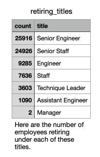
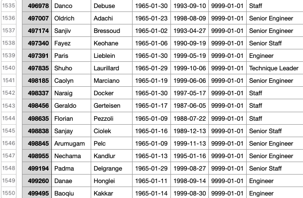
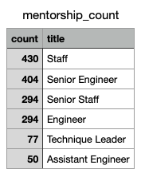

# Pewlett-Hackard-Analysis

## Overview of the analysis: Explain the purpose of this analysis.
The data we were required to pull consisted of creating tables and importing CSV files and exporting new data based on employee information provided for us by Bobby. Bobby has asked us figure out two things: the number of retiring employees per title and to identify employees who eligilible to participate in a mentorship program. After we extract this data, we need to analyze the data to determine the size of the "silver tsunami" (i.e., number of people retiring) in order to better prepare his company for upcoming changes in staffing.

## Results: Provide a bulleted list with four major points from the two analysis deliverables. Use images as support where needed.

- From an overview with our first table (retirement_titles), there are 133,776 employees about to retire. Once we filter the this table, however, and drop any duplicates to the table, the number drops to 72,458 employees about to retire. This shows approximately 60,000 of these employees either moved departments or were promoted to another role, which are the duplicates in the data.
- Looking at the retiring_titles table, we can see the largest title impacted by employees retiring is the Senior Engineer title followed by Senior Staff with almost the same amount of employees retiring. The smallest title impacted by this factor is Manager.

- Expounding on the previous point, approximately 35.7% of Senior Engineers are retiring, followed by 33.5% (Senior Staff), 12.8% (Engineer), 10.5% (Staff), 5% (Technique Leader), and 1.5% (Assistant Engineer). The Manager role percentage is neglible and does not seem to make any real impact.
- If we look at the mentorship_eligiblity table, there are 1,549 employees qualified for the mentorship program. (1550-1 = 1549, since the header is included in the count.)

## Summary: Provide high-level responses to the following questions, then provide two additional queries or tables that may provide more insight into the upcoming "silver tsunami."
##### How many roles will need to be filled as the "silver tsunami" begins to make an impact? 
According to the retiring title table, there are 72,458 employees retiring leading to that amount of roles needing to be filled.  
##### Are there enough qualified, retirement-ready employees in the departments to mentor the next generation of Pewlett Hackard employees?
When we view the retiring_titles tables side by side with a mentorship count, it becomes clear that there are not enough emplyoees qualified to fill these roles immediately. Doing a comparison, there are not nearly enough employees who are qualified for a Senior Engineer role; this is important to point out considering the amount of Senior Engineers retiring from this role. The one title that may appear to have a chance for filling in the gaps in employement is the Staff role. Although only 2 employees are retiring from the Manager role, there are no qualified employees for this role, leaving a gap. Maybe there are ways to consolidate different roles into different categories in order to make up for the difference. This would require another analysis of role responsibilities and seeing a crossover (if any) in the job titles. It would also require an analysis of the salaries that have been freed up due to retired employees and how to best allocate those funds.

 
